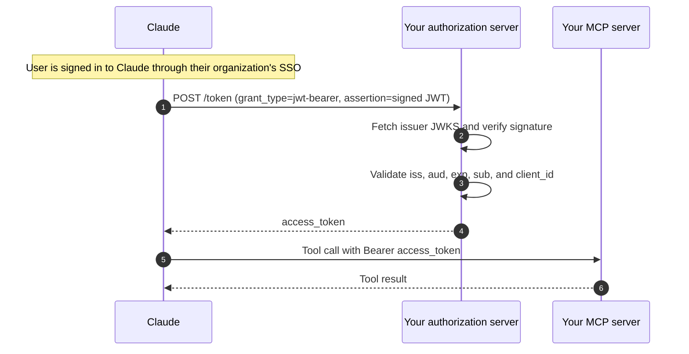

> ## Documentation Index
> Fetch the complete documentation index at: https://claude.com/docs/llms.txt
> Use this file to discover all available pages before exploring further.

# Enterprise Managed Auth for connectors

> Accept identity assertions from enterprise SSO so users connect to your MCP server without a separate OAuth consent step.

> [!NOTE]
> Enterprise Managed Auth is in beta and is available on Claude Team and Enterprise plans. Organizations can [join the waitlist](https://claude.com/form/ema-waitlist) to request access. MCP server developers and identity provider vendors can [register interest](https://docs.google.com/forms/d/e/1FAIpQLSf1goHGNDVFK7rncYuh6wnRpWSy7eGOcgL1i8uw3oyKFO9UUA/viewform) in supporting this flow.

Enterprise Managed Auth (EMA) lets a user connect to your MCP server silently, using the single sign-on session they already have with their organization. Instead of showing each user an OAuth consent screen, Claude presents your authorization server with an **identity assertion**: a signed JSON Web Token (JWT), issued by the customer's identity provider, that vouches for the user's identity.

Your authorization server validates the assertion and returns an access token in a single back-channel request. There is no browser redirect and no per-connector consent page. From the user's point of view, the connector is simply available as soon as their administrator enables it.

This flow is defined by the [MCP enterprise managed authorization extension](https://modelcontextprotocol.io/extensions/auth/enterprise-managed-authorization) and is built on the standard [JWT bearer authorization grant (RFC 7523)](https://datatracker.ietf.org/doc/html/rfc7523). The assertion profile follows the [Identity Assertion JWT Authorization Grant](https://datatracker.ietf.org/doc/draft-ietf-oauth-identity-assertion-authz-grant/).

> [!NOTE]
> This page is for connector developers who need their authorization server to accept Enterprise Managed Auth. Identity provider setup and Claude admin console configuration are handled by the customer's administrator.

## How it works

When a user whose organization has Enterprise Managed Auth configured invokes your connector, Claude obtains a signed identity assertion for that user and exchanges it directly at your token endpoint for an access token. The user never sees a browser redirect or a consent screen, and your MCP server receives the same kind of bearer token it would after the interactive OAuth flow.



Two parties are involved in this exchange: the customer's identity provider signs the assertion, and your authorization server verifies it and issues the access token. Both roles are often served by commercial identity platforms, so the distinction here is about which tenant plays which role rather than about product type. The identity provider publishes its signing keys as a JSON Web Key Set, and your authorization server fetches that key set to verify each assertion.

## Prerequisites

Before adding Enterprise Managed Auth, make sure the following are already in place.

* Your MCP server implements [MCP authorization](https://modelcontextprotocol.io/specification/draft/basic/authorization), including Protected Resource Metadata (PRM) discovery, and follows the [MCP security best practices](https://modelcontextprotocol.io/docs/tutorials/security/security_best_practices). See our [authentication guide](./authentication) for Claude-specific requirements.
* Your authorization server registers Claude using either [Anthropic-held client credentials](./authentication#anthropic-held-client-credentials) or a [Client ID Metadata Document](./authentication#dcr-and-cimd-details).

> [!WARNING]
> Dynamic Client Registration (DCR) is not supported with Enterprise Managed Auth. The identity provider stamps a fixed `client_id` into every assertion it issues, so your authorization server must already recognize that client before the first assertion arrives. A client created on the fly through DCR cannot satisfy this requirement because its identifier will never match the value in the assertion.

## Authorization server requirements

> [!NOTE]
> This section is for the authorization server operator. If your MCP server relies on a hosted identity platform, there is typically no code to write. Confirm that the platform supports the JWT bearer authorization grant and enable it for your tenant. If you run your own authorization server, the steps below describe what it needs to support.

Support for this flow varies by product. The underlying capability is the JWT bearer authorization grant ([RFC 7523](https://datatracker.ietf.org/doc/html/rfc7523)), which lets an authorization server exchange a signed JWT for an access token. Some commercial authorization servers and identity platforms support it today and others do not yet, so the first step is to confirm that yours does and that the customer's identity provider can be registered as a trusted issuer.

<Steps>
  **Ensure the JWT bearer grant is supported**

Your authorization server must accept `urn:ietf:params:oauth:grant-type:jwt-bearer` at its token endpoint and advertise it in the `grant_types_supported` array of its [authorization server metadata (RFC 8414)](https://datatracker.ietf.org/doc/html/rfc8414):

    ```json theme={null}
    {
      "issuer": "https://auth.example.com",
      "token_endpoint": "https://auth.example.com/token",
      "grant_types_supported": [
        "authorization_code",
        "refresh_token",
        "urn:ietf:params:oauth:grant-type:jwt-bearer"
      ]
    }
    ```

    Claude reads this metadata to discover whether your server supports Enterprise Managed Auth. The grant type must be listed here for the feature to be offered to the customer, even if your token endpoint would already accept it silently.

  **Register the trusted issuer**

For each customer, your authorization server needs to trust that customer's identity provider as a JWT issuer. Your authorization server fetches the identity provider's JSON Web Key Set and uses it to verify the signature on every incoming assertion.

    Your authorization server is responsible for maintaining an explicit allowlist of trusted issuer URLs per tenant rather than accepting any well-formed JWT. An assertion whose `iss` is not on the tenant's allowlist must be rejected with `invalid_grant`, even if the signature is valid.

    > [!WARNING]
> Never accept an identity assertion without full validation. As with all OAuth token handling, your authorization server must verify the signature, issuer, audience, expiry, and subject on every request. Use the JWT validation built into your authorization server product. If you need to inspect assertions in your own code, use the validation library or token introspection endpoint provided by your authorization server vendor rather than writing custom verification logic.

  **Understand the token request**

Claude sends a form-encoded `POST` to your authorization server's token endpoint:

    ```http theme={null}
    POST /token HTTP/1.1
    Host: auth.example.com
    Content-Type: application/x-www-form-urlencoded

    grant_type=urn:ietf:params:oauth:grant-type:jwt-bearer
    &assertion=eyJhbGciOi...
    &client_id=your-registered-client-id
    &scope=openid profile
    &resource=https://mcp.example.com
    ```

    The `assertion` parameter carries the signed JWT. The `client_id` is the value Claude is registered under at your authorization server. Claude also includes the `resource` parameter ([Resource Indicators, RFC 8707](https://www.rfc-editor.org/rfc/rfc8707)) set to your MCP server URL whenever the customer's identity provider supports forwarding it. Some identity provider configurations cannot pass a resource indicator through, so your authorization server should accept the request whether or not `resource` is present and use it for audience binding when it is.

    Your authorization server validates the assertion according to the [JWT bearer token processing rules (RFC 7523 section 3)](https://datatracker.ietf.org/doc/html/rfc7523#section-3) and returns a standard OAuth token response. Claude then presents the returned access token as a `Bearer` credential on calls to your MCP server, exactly as it does after the interactive flow.

    > [!NOTE]
> The access token lifetime is set by your authorization server, and the assertion lifetime is set by the customer's identity provider. Anthropic does not control either value.
</Steps>

## Testing your implementation

End-to-end testing requires a Claude organization with Enterprise Managed Auth enabled and an identity provider tenant configured to issue assertions for your authorization server's audience.

> [!NOTE]
> If the customer's identity provider is Okta, refer to Okta's [Cross App Access participation guide](https://support.okta.com/help/s/article/claude-enterprise-managed-auth-with-okta-cross-app-access-xaa-beta-participation-guide?language=en_US) for the tenant configuration steps.

> [!NOTE]
> Enterprise Managed Auth is in beta. [Register interest](https://docs.google.com/forms/d/e/1FAIpQLSf1goHGNDVFK7rncYuh6wnRpWSy7eGOcgL1i8uw3oyKFO9UUA/viewform) to get onboarded for testing.

## Related resources

<CardGroup cols={2}>
  <Card title="Authentication for connectors" icon="key" href="./authentication">
    Baseline OAuth requirements your server must already meet.
  </Card>

  <Card title="Lazy authentication" icon="lock-open" href="./lazy-authentication">
    Defer OAuth until a protected tool is actually invoked.
  </Card>

  <Card title="Testing your connector" icon="flask" href="./testing">
    Verify your connector works end to end in Claude.
  </Card>

  <Card title="Troubleshooting" icon="wrench" href="./troubleshooting">
    Diagnose common authentication and connection issues.
  </Card>
</CardGroup>
